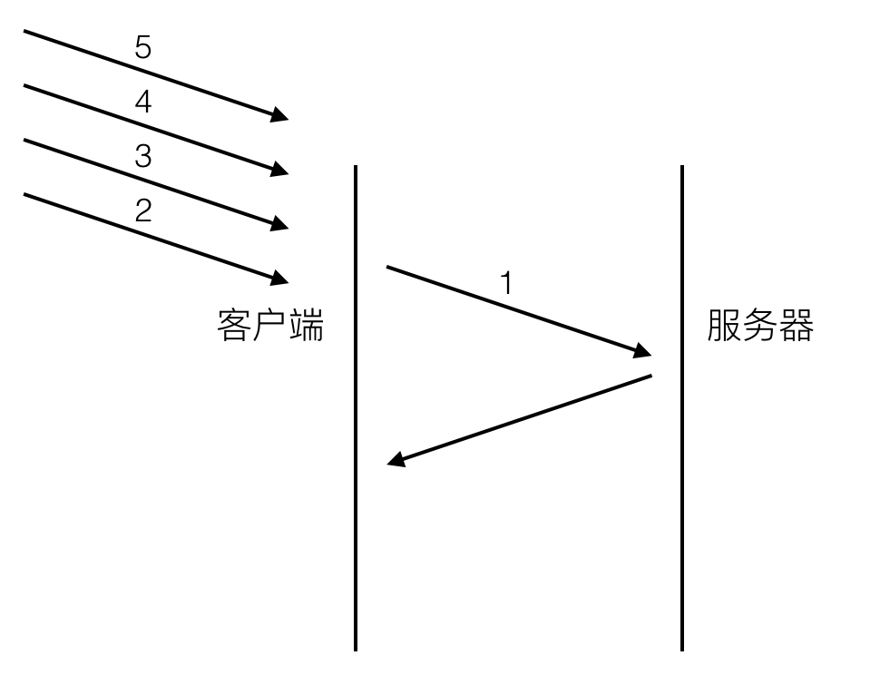
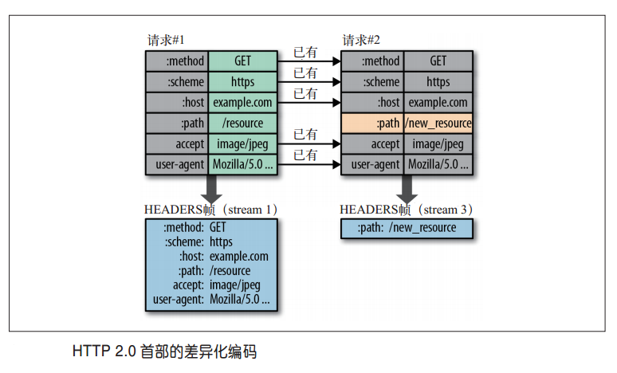
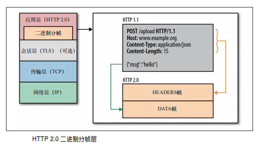
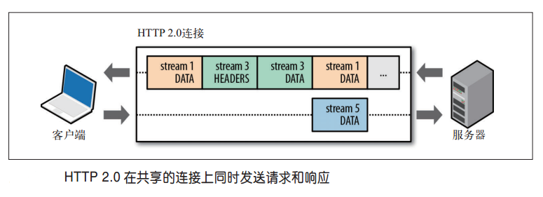
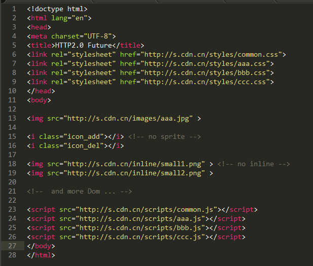

## http2.0的前世
>
http2.0的前世是http1.0和http1.1这两兄弟。虽然之前仅仅只有两个版本，但这两个版本所包含的协议规范之庞大，足以让任何一个有经验的工程师为之头疼。http1.0诞生于1996年，协议文档足足60页。之后第三年，http1.1也随之出生，协议文档膨胀到了176页。不过和我们手机端app升级不同的是，网络协议新版本并不会马上取代旧版本。实际上，1.0和1.1在之后很长的一段时间内一直并存，这是由于网络基础设施更新缓慢所决定的。今天的http2.0也是一样，新版协议再好也需要业界的产品锤炼，需要基础设施逐年累月的升级换代才能普及。

## http1.x 遇到了那些难题？
1. 慢（因为延迟，所以慢）
>
影响一个网络请求的因素主要有两个，**带宽**和**延迟**。今天的网络基础建设已经使得带宽得到极大的提升，大部分时候都是延迟在影响响应速度。
>
延迟：其实是TCP建立连接时三次握手有1.5个RTT（round-trip time）的延迟
	
2. 连接无法复用
>
连接无法复用会导致每次请求都经历三次握手（1.5RTT【round-trip time】的延迟）和慢启动。三次握手在高延迟的场景下影响较明显，慢启动则对文件类大请求影响较大。

3. head of line blocking
>
head of line blocking 会导致带宽无法被充分利用，以及后续健康请求被阻塞。
>
假设有5个请求同时发出,如下图（图一），对于http1.0的实现，在第一个请求没有收到回复之前，后续从应用层发出的请求只能排队，请求2，3，4，5只能等请求1的response回来之后才能逐个发出。网络通畅的时候性能影响不大，一旦请求1的request因为什么原因没有抵达服务器，或者response因为网络阻塞没有及时返回，影响的就是所有后续请求，问题就变得比较严重了。

(图一)

## 开拓者SPDY
>
2012年google如一声惊雷提出了SPDY的方案，大家才开始从正面看待和解决老版本http协议本身的问题，这也直接加速了http2.0的诞生。实际上，http2.0是以SPDY为原型进行讨论和标准化的。为了给http2.0让路，google已决定在2016年不再继续支持SPDY开发，但在http2.0出生之前，SPDY已经有了相当规模的应用，作为一个过渡方案恐怕在还将一段时间内继续存在。现在不少app客户端和server都已经使用了SPDY来提升体验，http2.0在老的设备和系统上还无法使用（iOS系统只有在iOS9+上才支持），所以可以预见未来几年spdy将和http2.0共同服务的情况。

### SPDY解决哪些事情

* 连接数的选择 （连接复用）

>连接到底是基于域名来建立，还是不做区分所有子域名都共享一个连接，这个策略选择上值得商榷。google的测试结果测试了两种方案，看结果似乎是单一连接性能高于多域名连接方式。之所以出现这种情况是由于网页所有的资源请求并不是同一时间发出，后续发出的子域名请求如果能复用之前的tcp连接当然性能更好。实际应用场景下应该也是单连接共享模式表现好。

* 带宽的影响 （连接复用）

>测试基于两种带宽环境，一慢一快。网速快的环境下对减小延迟的提升更大，单连接模式下可以提升至60%。原因也比较简单，带宽越大，复用连接的请求完成越快，由于三次握手和慢启动导致的延迟损耗就变得更明显。

除了连接模式和带宽之外，丢包率和RTT也是需要测试的参数。SPDY对header的压缩有80%以上，整体包大小能减少大概40%，发送的包越少，自然受丢包率影响也就越小，所以丢包率大的恶劣环境下SPDY反而更能提升体验。

### 与http的关系
>
SPDY并不用于取代HTTP，它只是修改了HTTP的请求与应答在网络上传输的方式；这意味着只需增加一个SPDY传输层，现有的所有服务端应用均不用做任何修改。 当使用SPDY的方式传输，HTTP请求会被处理、标记简化和压缩。比如，每一个SPDY端点会持续跟踪每一个在之前的请求中已经发送的HTTP报文头部，从而避免重复发送还未改变的头部。而还未发送的报文的数据部分将在被压缩后被发送。
>
http/2主要以spdy技术为主。SPDY协议类似于HTTP，但旨在缩短网页的加载时间和提高安全性。SPDY协议通过压缩、多路复用和优先级来缩短加载时间

## 救世主 http2.0
>
HTTP 2.0即超文本传输协议 2.0，是下一代HTTP协议。是由互联网工程任务组（IETF）的Hypertext Transfer Protocol Bis (httpbis)工作小组进行开发。是自1999年http1.1发布后的首个更新。HTTP 2.0在2013年8月进行首次合作共事性测试。**在开放互联网上HTTP 2.0将只用于https://网址**，而 http://网址将继续使用HTTP/1，目的是在开放互联网上增加使用加密技术，以提供强有力的保护去遏制主动攻击。DANE RFC6698允许域名管理员不通过第三方CA自行发行证书。

### http2.0 解决了那些事情
* 多路复用
> 
多路复用通过多个请求stream共享一个tcp连接的方式，解决了http1.x holb（head of line blocking）的问题，降低了延迟同时提高了带宽的利用率。（如图二）

* 压缩头部
>
HTTP/2.0规定了在客户端和服务器端会使用并且维护「首部表」来跟踪和存储之前发送的键值对，对于相同的头部，不必再通过请求发送，只需发送一次。
>
事实上,如果请求中不包含首部（例如对同一资源的轮询请求），那么首部开销就是零字节。此时所有首部都自动使用之前请求发送的首部。
>
如果首部发生变化了，那么只需要发送变化了数据在Headers帧里面，新增或修改的首部帧会被追加到“首部表”。首部表在 HTTP2.0的连接存续期内始终存在,由客户端和服务器共同渐进地更新。

* 二进制分帧
>
在应用层与传输层之间增加一个二进制分帧层，以此达到“在不改动HTTP的语义，HTTP 方法、状态码、URI及首部字段的情况下，突破HTTP1.1的性能限制，改进传输性能，实现低延迟和高吞吐量。”
>
在二进制分帧层上，HTTP2.0会将所有传输的信息分割为更小的消息和帧,并对它们采用二进制格式的编码，其中HTTP1.x的首部信息会被封装到Headers帧，而我们的request body则封装到Data帧里面。

>
客户端和服务器可以把HTTP消息分解为互不依赖的帧，然后乱序发送，最后再在另一端把它们重新组合起来。注意，同一链接上有多个不同方向的数据流在传输。客户端可以一边乱序发送stream，也可以一边接收者服务器的响应，而服务器那端同理。

* 请求优先级
>多路复用导致所有资源都是并行发送，那么就需要「优先级」的概念了，这样就可以对重要的文件进行先传输，加速页面的渲染。

* 服务器推送
>服务器推送是指在客户端请求之前发送数据的机制。

另外有一点值得注意的是，客户端如果退出某个业务场景，出于流量或者其它因素需要取消server push，也可以通过发送RST_STREAM类型的frame来做到。

## http2.0 跟 SPDY 不同之处：

1. HTTP/2 支持明文 HTTP 传输，而 SPDY 强制使用 HTTPS
2. HTTP/2 消息头的压缩算法采用 HPACK，而非 SPDY 采用的 DELEFT

以后我们的代码就可以这样写了：

[生成TLS证书参考](https://www.digitalocean.com/community/tutorials/how-to-create-a-ssl-certificate-on-nginx-for-centos-6)